---

---

---

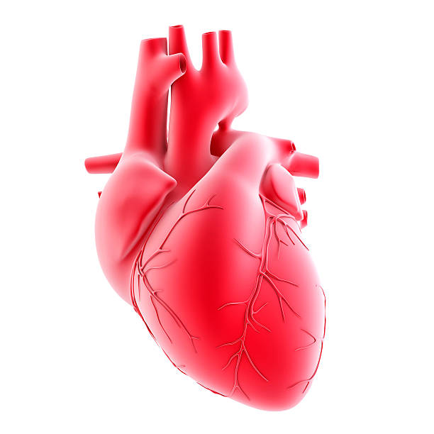

---

---

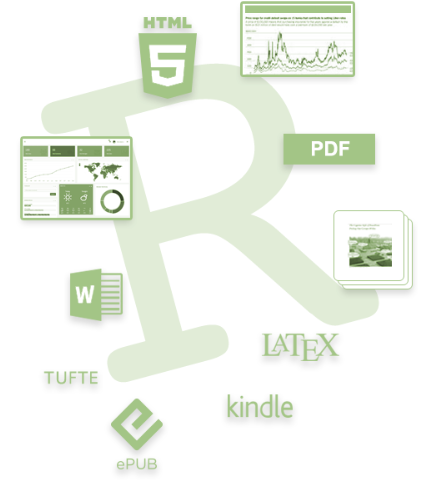

---

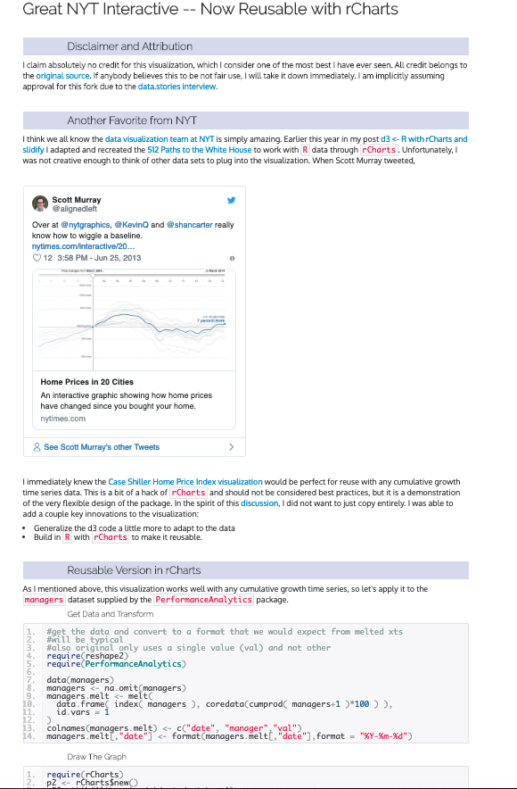

---

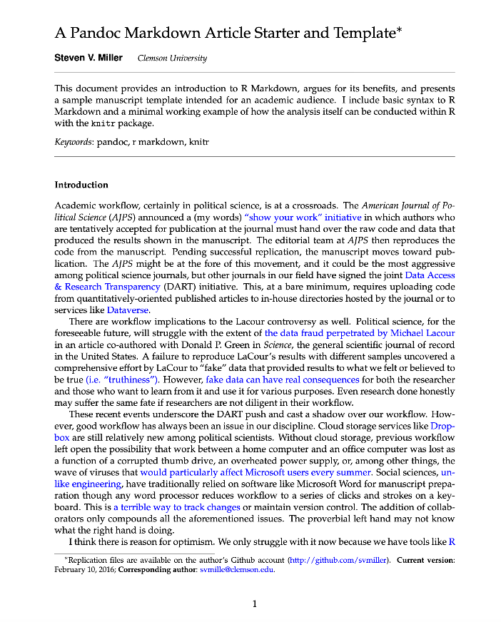

---

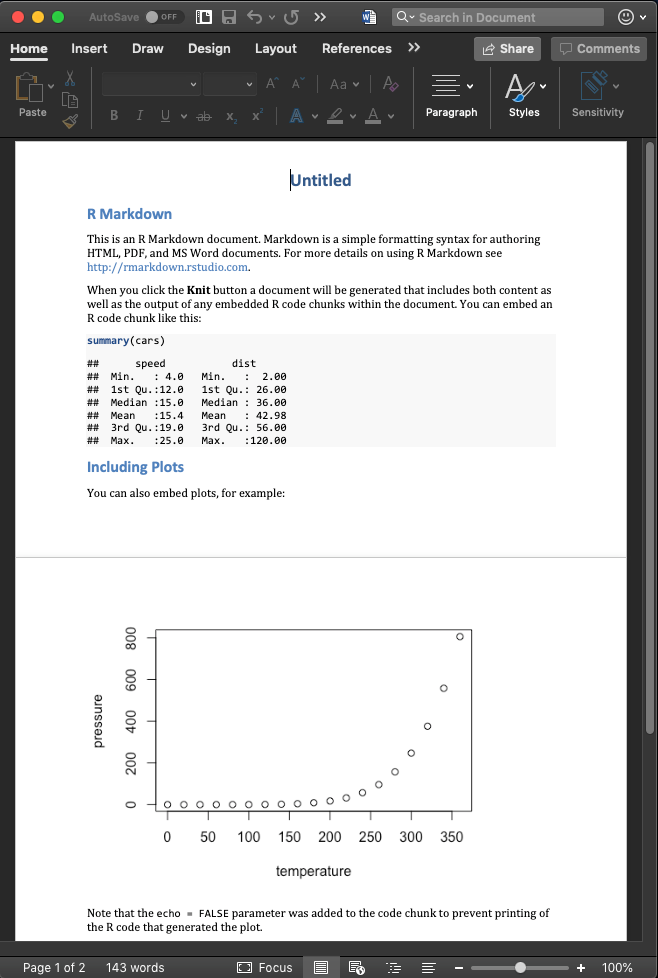

---

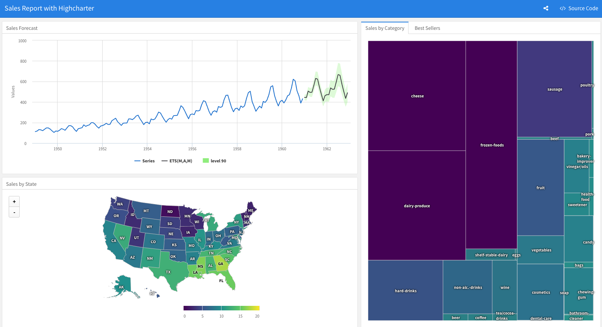

---

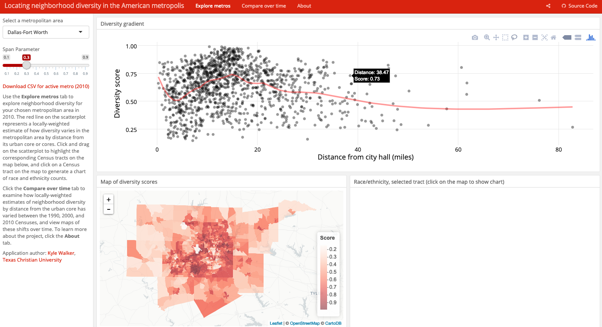

---

.pull-left[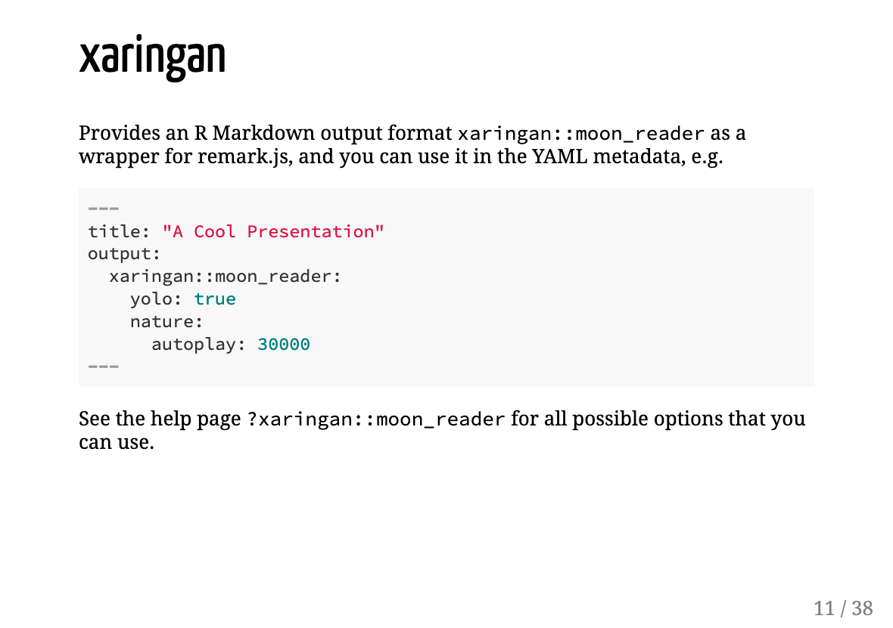]

.pull-right[]

---

---

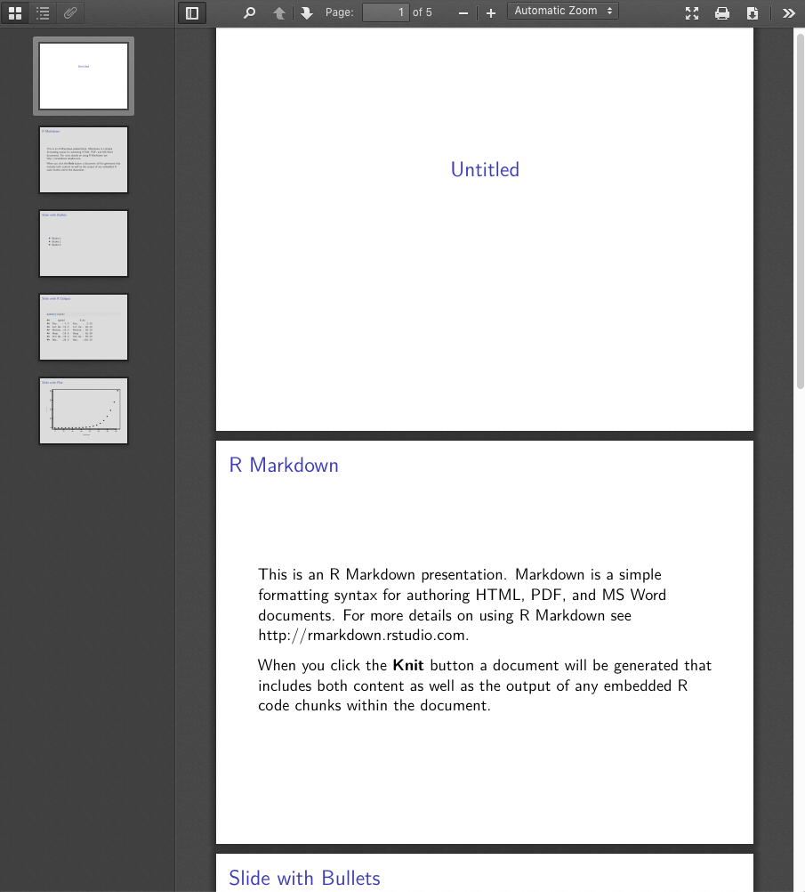

---

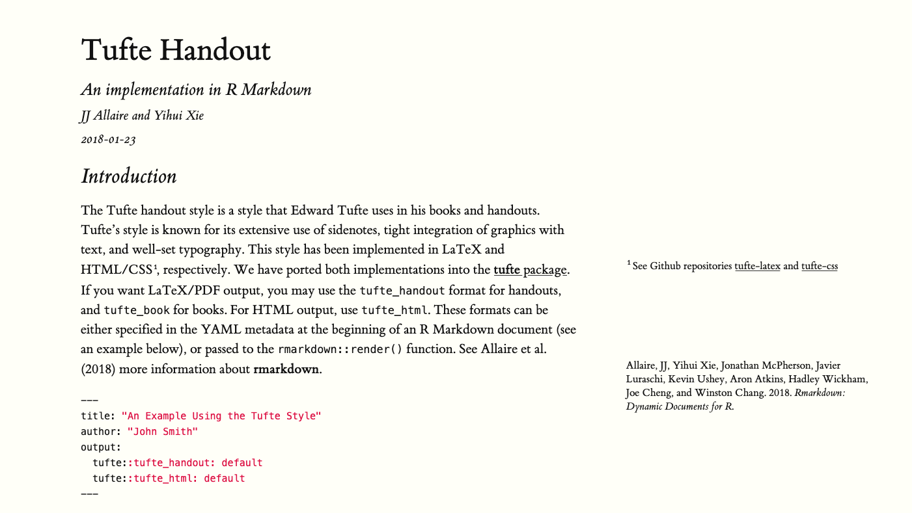

---

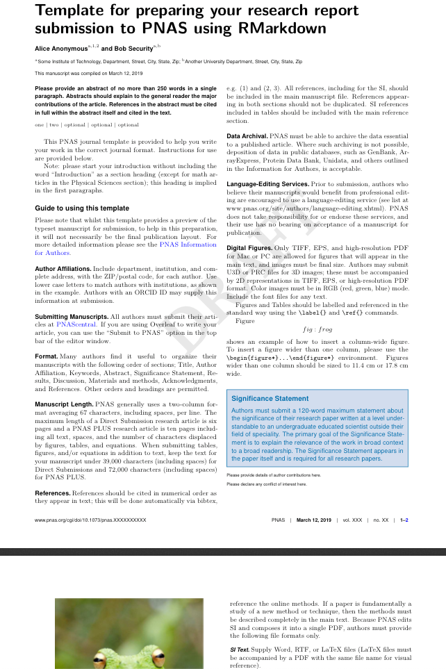

---

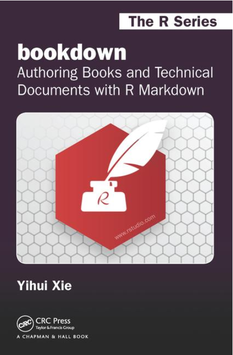

---

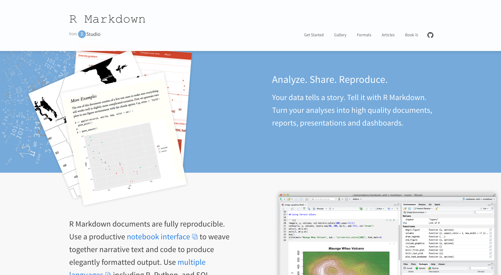

---

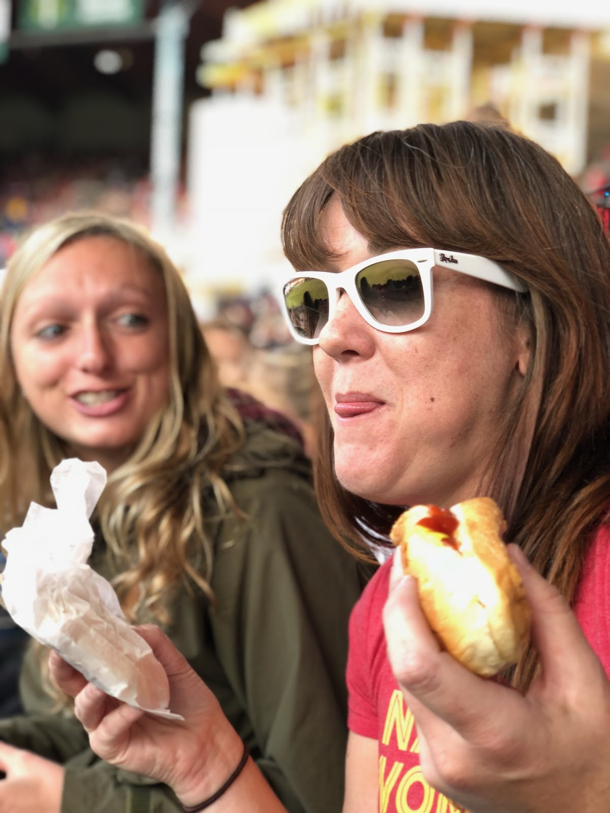

---

---
class: inverse
background-image: url('assets/img/image33.png')
background-size: cover

---
class: inverse
background-image: url('assets/img/image38.png')
background-size: cover

---
class: inverse
background-image: url('assets/img/image46.png')
background-size: cover

---
class: inverse
background-image: url('assets/img/image41.png')
background-size: cover

---
class: inverse
background-image: url('assets/img/image54.png')
background-size: cover

---
class: inverse
background-image: url('assets/img/image27.png')
background-size: cover

---
class: inverse
background-image: url('assets/img/image32.png')
background-size: cover

---
class: inverse
background-image: url('assets/img/image37.png')
background-size: cover

---
class: inverse
background-image: url('assets/img/image45.png')
background-size: cover

---
class: inverse
background-image: url('assets/img/image53.png')
background-size: cover

---
class: inverse
background-image: url('assets/img/image22.jpg')
background-size: cover

---
class: inverse
background-image: url('assets/img/image36.png')
background-size: cover

---
class: inverse
background-image: url('assets/img/image40.png')
background-size: cover

---
class: inverse
background-image: url('assets/img/image49.png')
background-size: cover

---
class: inverse
background-image: url('assets/img/image26.png')
background-size: cover

---
class: inverse
background-image: url('assets/img/image31.png')
background-size: cover

---
class: inverse
background-image: url('assets/img/image44.png')
background-size: cover

---
class: inverse
background-image: url('assets/img/image52.png')
background-size: cover

---
class: inverse
background-image: url('assets/img/image57.png')
background-size: cover

---
class: inverse
background-image: url('assets/img/image25.png')
background-size: cover

---
class: inverse
background-image: url('assets/img/image35.png')
background-size: cover

---
class: inverse
background-image: url('assets/img/image43.png')
background-size: cover

---
class: inverse
background-image: url('assets/img/image48.png')
background-size: cover

---
class: inverse
background-image: url('assets/img/image56.png')
background-size: cover

---
class: inverse
background-image: url('assets/img/image30.png')
background-size: cover

---
class: inverse
background-image: url('assets/img/image39.png')
background-size: cover

---
class: inverse
background-image: url('assets/img/image51.png')
background-size: cover

---
class: inverse
background-image: url('assets/img/image24.png')
background-size: cover

---
class: inverse
background-image: url('assets/img/image29.png')
background-size: cover

---
class: inverse
background-image: url('assets/img/image42.png')
background-size: cover

---
class: inverse
background-image: url('assets/img/image47.png')
background-size: cover

---
class: inverse
background-image: url('assets/img/image50.png')
background-size: cover

---
class: inverse
background-image: url('assets/img/image55.png')
background-size: cover

---
class: inverse
background-image: url('assets/img/image28.png')
background-size: cover

---
class: inverse
background-image: url('assets/img/image23.png')
background-size: cover

---

---

---

---

